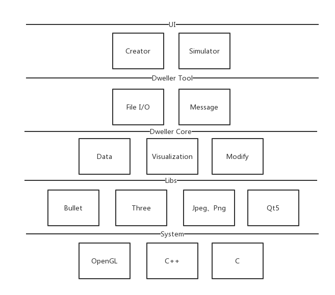
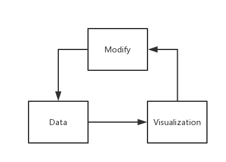
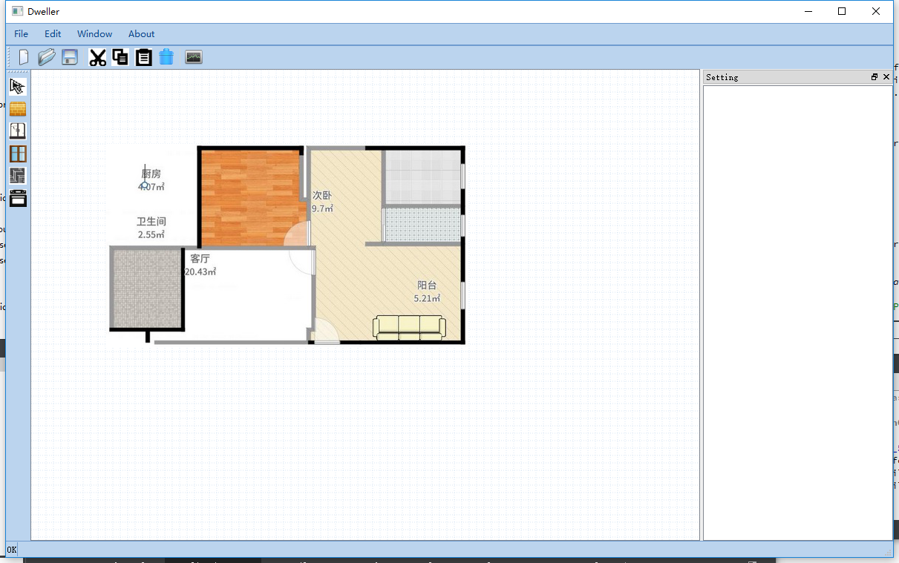
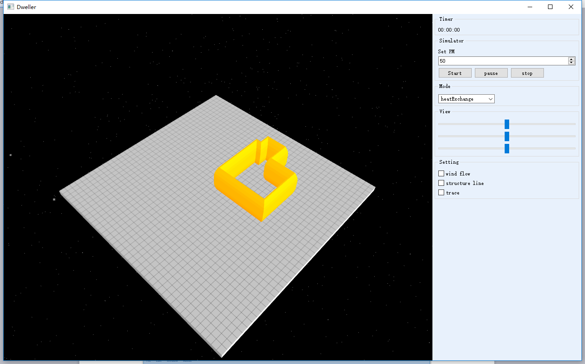
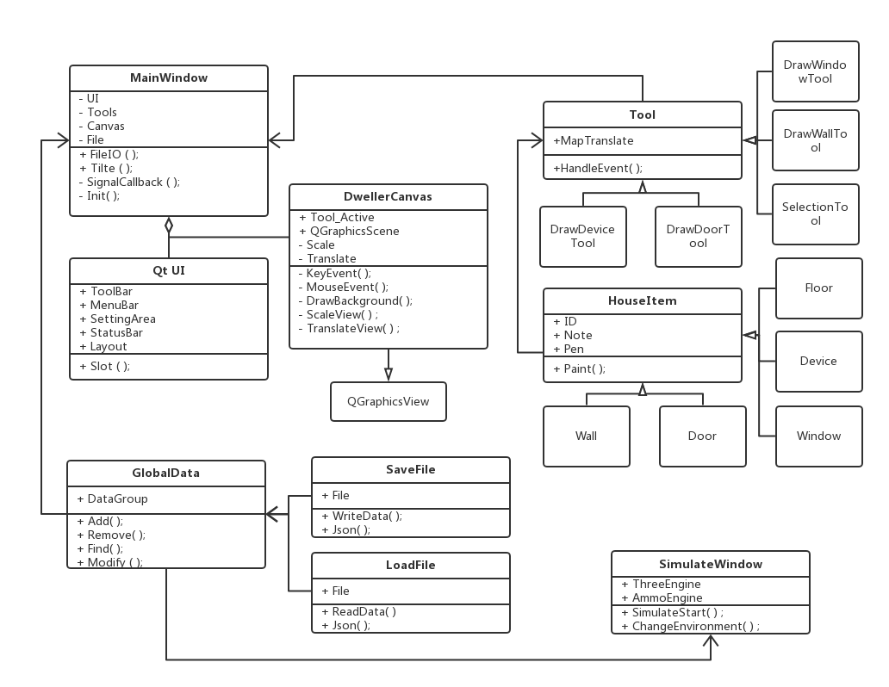

#Dweller

## 概述

Dweller是一款将户型图绘制为数字地图的软件，支持2D图片导入，3D仿真，自定义数据格式等。

###背景介绍

随着AI、大数据、云计算的发展，智能音箱和扫地机器人似乎预示着智能家居领域将迎来第二春。一批生产传统家居设备的企业也顺应潮流，使用嵌入式技术对传统家电进行升级改造，以此向智能家居领域靠拢。但是纵观当前市场上的智能家居产品，智能音箱能否根据客户所处位置调整声音环绕，以使得客户获得最好的听觉效果？扫地机器人能否根据户型图高效地对地面进行清扫？空气净化器能否根据门窗及户型调整气流组织？显然答案是否定的。
可以遗憾的说，当前智能家居设备仍然与传统家电产品类似，要么没有回归家居的本质，要么还有许多不足之处，其中的关键原因就是家庭环境基础数据服务的缺失。没有家庭基础环境数据的支持，智能设备工作得再好，也无法根据客户家庭环境进行个性化的服务。这就如同自动驾驶汽车安装了许多传感器，但却没有安装导航地图一样。所以，建立家庭环境数据及模拟方案，对当前智能家居设备非常重要。
在智能家居设备研发阶段，可以使用AI技术跑一遍户型图数据库，从而得知设备设计上的不足。例如，对于新风机，可以预先了解何种户型会存在气流组织的问题；对于扫地机器人，可以预先了解何种户型会存在扫地路径效率低下的问题，等等。
智能家居设备核心在于软件，比较抽象，这导致销售人员和客户较难理解不同智能家居设备之间的差异。在智能家居设备销售阶段，可以创建3D模拟场景，让用户直观地了解智能家居设备如何运作。
在智能家居设备的运行阶段，设备可以远程读取户型图数据或从云服务器获取设备模拟运行方案，从而达到针对客户的家居环境进行个性化的服务。
综上，设计一种适合智能家居环境的基础数据服务方式，对智能家居产品生命周期的各个阶段都有着重要意义。

###软件描述

Dweller整体上包含客户端和云数据库两大部分。云数据库负责提供户型图数据及智能家居设备数据，客户端负责这些数据的处理及可视化。由于Dweller主要业务流程均在客户端部分完成，所以在本文档中以介绍Dweller的客户端部分为主。在接下来的篇幅中，如果没有特别说明，Dweller均指Dweller客户端部分。

###软件特性

## 整体架构

Dweller整体架构层次分为三部分：UI层、工具层、核心层。UI层Creator负责展示设备及户型图的创建、存取、修改。UI层Simulator负责场景展示及与用户交互。工具层负责文件处理及通信。核心层负责数据可视化的实现。

###核心架构

Dweller的基本功能为模拟智能家居设备在房屋环境中的工作状态。该模拟功能的运作基于两种数据：设备数据、户型图数据，生产出持续的、可变更的3D动态场景。总体上说，Dweller的架构应包含数据、变更及可视化三部分，其关键在于数据流处理、数据流变更、可视化交互。考虑到架构的简洁及灵活性，以上三部分设计为批处理风格。设备数据及户型图数据作为一个整体从Data模块传递给Visualization模块；Visualization模块生成场景后将数据整体传递给Modify模块；用户可以使用Modify模块更改数据，更改后的数据将整体传递回Data模块用作下一阶段可视化场景的生成。
数据-可视化-变更循环作为Dweller的核心架构，在Dweller的核心之中运作，与GUI是分离的，GUI通过消息机制与Dweller核心进行通讯。

###数据模块

设备数据分为两种：标定数据及运行时数据，取自设备配置文件。户型图数据为不可变更的数据，取自户型图文件。设备文件和户型图文件可以取自Dweller服务器，也可以本地存取和更改。数据模块根据文件格式读取设备文件及户型图文件内的数据，并在内存中进行组织。在内存中组织数据的方式有两种：一种是不可修改的数据，包括设备标定数据、户型图数据；一种是可以修改的数据，包括设备运行数据、场景数据。从这两种数据创建实例的方法是不同的。

###可视化模块

从数据模块传来的数据实例经过可视化处理成为3D场景。进行3D渲染的顺序为：户型、设备、粒子、辅助线。这些工作主要使用OpenGL库来完成。

###变更模块

在可视化区域创建后，用户可通过GUI与核心交互。交互过程中，设备运行数据、场景数据会随之改变。在某些情况下，设备运行数据和场景数据也会自发的改变。这些变更通过模块内的计算和处理直接作用与数据，然后将数据实例返回至数据模块。

##数据结构

Dweller中的数据结构主要考虑可视化和变更两部分的使用。
不可变更的数据为户型图数据、设备标定数据；可变更的数据为设备运行数据、场景数据。
户型图数据：墙面（包含门窗）、地板参数表、门参数表、窗参数表、水电气参数表。
设备标定数据：设备结构、设备类型、设备参数表。
设备运行数据：行为表。
场景数据：粒子表、辅助线表。

##文件结构

户型图数据及设备数据均使用JSON字符串存入文件内，格式如下表。
结构	名称	内容	大小
文件头	标识	"Dweller"	char[7]
	版本号	"_v"+"000"	char[5]
	分隔符	"/n"	char
文件块1	文件类型	"House" = 户型图文件	char[5]
		"Device" = 设备文件	char[6]
	分隔符	"/n"	char
文件块2	分隔符	"#Content/n"	String
	墙面	{"Wall":[{"WallID":"","WallPosition":"","WallThickness":""},{"DoorID","DoorPosition":"","DoorParam":{}},{"WindowID","WindowPosition":"","WindowParam":{}}]}	JSON String
	分隔符	"/n"	char
	地板	{"Floor":[{"FloorID":"","FloorPosition":"","FloorParam":{}}]}	JSON String
	分隔符	"/n"	char
	其他参数	Reserved	/
	分隔符	"/n"	char
	设备	{"Device":[{"DeviceParam":{}},{"DeviceStruture":{}}]}	JSON String
	分隔符	"/n"	char
文件尾	标识	"#End/n"	String

##GUI设计

Dweller的GUI主要分为两个窗口：一个窗口为Creator，主要负责户型图绘制及设备配置；另外一个窗口为Simulator，负责场景模拟。
Creator界面比较复杂，出于效率考虑，使用代码直接布置。Simulator界面比较简单，可以使用QtQuick技术，通过qml直接生成。
GUI整体色调为浅蓝（#e8f1fc）。
下面分别介绍两者的实际运行界面设计：

Creator运行界面

Creator实际运行界面分为标题栏、菜单栏、工具栏、绘图栏、绘图区、属性栏。窗口中央为绘图区，绘图区有辅助线，单位长度对应的实际比例为10cm/格。绘图栏处于绘图区左方，所有绘制工具均放置在绘图栏内。绘制工具包括：选择工具、绘制墙面、绘制门、绘制窗口、绘制地板、绘制设备。属性栏处于绘制区右方，当选中绘制区内对象时，该对象的属性显示在属性栏。

Simulator运行界面

Simulator实际运行界面分为显示区域，控制区域。显示区域显示当前的模拟情况，并响应用户操作。控制区域主要负责对模拟场景的配置和控制。目前功能包括：显示模拟时间、开始、暂停、停止模拟器、配置设备运行模式、设置视角、配置场景选项。

##详细设计

###整体UML

EOF.